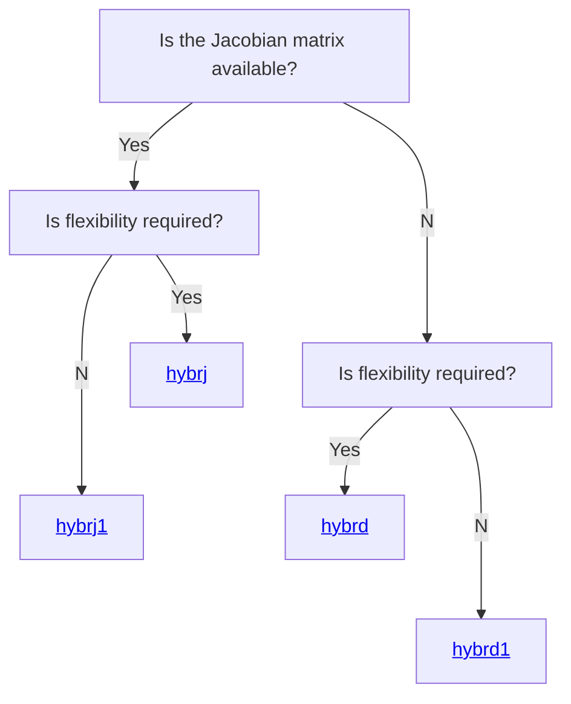
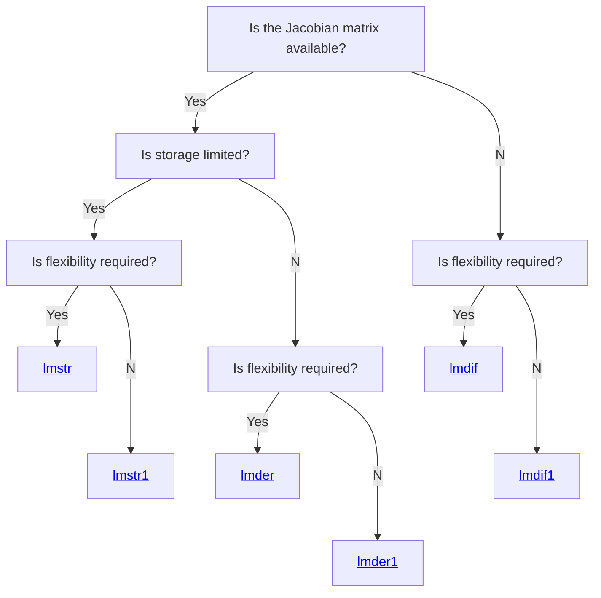

============

Modernized Minpack


### Description

*Minpack* includes software for solving nonlinear equations and
nonlinear least squares problems.  Five algorithmic paths each include
a core subroutine and an easy-to-use driver.  The algorithms proceed
either from an analytic specification of the Jacobian matrix or
directly from the problem functions.  The paths include facilities for
systems of equations with a banded Jacobian matrix, for least squares
problems with a large amount of data, and for checking the consistency
of the Jacobian matrix with the functions.

This version is a modernization of the original Fortran 77 code.
Modifications include:

* Conversion from fixed (`.f`) to free-form (`.f90`) source.
* Modified the tests so they can be automatically run in the [CI](https://github.com/fortran-lang/minpack/actions)
* Implementation of C API for all procedures
* Python bindings to the *minpack* C API

Further updates are planned...


### Installation

To build this project from the source code in this repository you need to have
a Fortran compiler supporting Fortran 2008 and one of the supported build systems:

- [fpm](https://fpm.fortran-lang.org) version 0.3.0 or newer
- [meson](https://mesonbuild.com) version 0.55 or newer, with
  a build-system backend, *i.e.* [ninja](https://ninja-build.org) version 1.7 or newer

The project is hosted on GitHub and can be obtained by cloning it with

```
git clone https://github.com/fortran-lang/minpack
cd minpack
```


#### Building with fpm

Invoke fpm in the project root with

```
fpm build
```

To run the testsuite use

```
fpm test
```

You can access the *minpack* program programs using the run subcommand

```
fpm run --example --list
```

To use *minpack* in your project include it as dependency in your package manifest

```toml
[dependencies]
minpack.git = "https://github.com/fortran-lang/minpack"
```


#### Building with meson

Optional dependencies are


Setup a build with

```
meson setup _build
```

The following build options can be adjusted:

- the Fortran compiler can be selected by setting the ``FC`` environment variable.
- the installation location can be set with the ``--prefix=/path/to/install`` option
- with the ``-Dpython=true`` option the Python bindings can be built

  - Python 3.6  or newer is required with the CFFI package installed
  - the actual Python version can be selected using ``-Dpython_version=/path/to/python``

To compile and run the projects testsuite use

```
meson test -C _build --print-errorlogs
```

If the testsuite passes you can install with

```
meson install -C _build
```

This might require administrator access depending on the chosen install prefix.
*Minpack* should now be available on your system, you can check by using the *pkg-config* tool

```
pkg-config --modversion minpack
```

To include *minpack* in your project add the following wrap file to your *subprojects* directory:

```ini
[wrap-git]
directory = minpack
url = https://github.com/fortran-lang/minpack
revision = head
```

You can retrieve the dependency from the wrap fallback with

```meson
minpack_dep = dependency('minpack', fallback: ['minpack', 'minpack_dep'])
```

and add it as dependency to your targets.


#### Supported compilers

The following compilers are known to work with *minpack*.

| Compiler | Version | Platform | Architecture | Minpack version |
| --- | --- | --- | --- | --- |
| GCC | 10.2 | Ubuntu 20.04 | x86\_64 | latest |
| GCC | 10.2 | MacOS 11 | x86\_64 | latest |
| GCC/MinGW | 10.3 | Windows Server 2022 | x86\_64 | latest |
| Intel | 2021.5.0 | Manjaro Linux | x86\_64 | [fa4bcbd] |
| Intel LLVM | 2022.0.0 | Manjaro Linux | x86\_64 | [fa4bcbd] |
| NAG | 7.1 | RHEL | x86\_64 | [fa4bcbd] |

[fa4bcbd]: https://github.com/fortran-lang/minpack/tree/fa4bcbdc7a926a3607e8ff5397ca356a74c50d5a

The combinations annotated with *latest* are tested continuously for this project, for all other results the last commit or tag where this behavior was verified is linked.
A list of tested compilers which are currently not working or only partially working and the respective issue are listed below.

| Compiler | Version | Platform | Architecture | Status |
| --- | --- | --- | --- | --- |
| GCC | 11.1 | MacOS 12 | Arm64 | C-API not supported |
| Nvidia HPC SDK | 22.3 | Manjaro Linux | x86\_64 | Unit tests are failing |

Please share your experience with successful and failing builds for compiler/platform/architecture combinations not covered above.


### Usage

*Minpack* provides a series of solves for systems of nonlinear equations and nonlinear least squares problems.
To select the approriate solver for your problem checkout the diagrams below.

*Decision tree for systems of nonlinear equations*



*Decision tree for nonlinear least squares problems*



In Fortran projects the above procedures can be made available by including the ``minpack_module``.
Examples can be found in the [example](./example) directory.

To use *minpack* in non-Fortran projects which are compatible with C checkout the [``minpack.h``](./include/minpack.h) header for the available symbols and callback function signatures.
Python bindings are available and documented in the [``python``](./python) subdirectory of this project.


### Documentation

 * The API documentation for the latest default branch can be found [here](https://fortran-lang.github.io/minpack/).  This is generated by processing the source files with [FORD](https://github.com/Fortran-FOSS-Programmers/ford).


### License

The Minpack source code and related files and documentation are distributed under a permissive free software [license](https://github.com/fortran-lang/minpack/blob/HEAD/LICENSE.txt) (BSD-style).


### History

Minpack has been developed in 1980 by Jorge J. Moré, Burton S. Garbow, Kenneth
E.  Hillstrom and other contributors as listed on page 8 of the [User Guide for
MINPACK-1](http://cds.cern.ch/record/126569/files/CM-P00068642.pdf).

Since 2012 Ondřej Čertík has maintained a GitHub repository for minpack with
many contributions from Carlos Une and Zuo Zhihua.

In 2021 Jacob Williams started a new minpack repository at GitHub and
translated all files from fixed form to free form and other modernizations.

We have discussed at https://github.com/fortran-lang/minpack/issues/8 which
version to use as the community maintained fortran-lang version and decided to
use the latter repository, which became the fortran-lang version. We have
been porting improvements from the former repository over to the new fortran-lang repository.


### Contributors

Many people have contributed to Minpack over the years:

* Jorge J. Moré, Burton S. Garbow, Kenneth E.  Hillstrom and other contributors
  as listed on page 8 of the [User Guide for MINPACK-1](http://cds.cern.ch/record/126569/files/CM-P00068642.pdf).
* Ondřej Čertík
* Carlos Une
* Zuo Zhihua
* Jacob Williams
* Sebastian Ehlert


### See also

  * [nlesolver-fortran](https://github.com/jacobwilliams/nlesolver-fortran)


### References
  * Original sourcecode from: [Netlib](https://www.netlib.org/minpack/)
  * J. J. Moré, B. S. Garbow, and K. E. Hillstrom, [User Guide for MINPACK-1](http://cds.cern.ch/record/126569/files/CM-P00068642.pdf), Argonne National Laboratory Report ANL-80-74, Argonne, Ill., 1980.
  * J. J. Moré, D. C. Sorensen, K. E. Hillstrom, and B. S. Garbow, The MINPACK Project, in Sources and Development of Mathematical Software, W. J. Cowell, ed., Prentice-Hall, pages 88-111, 1984.
  * M. J. D. Powell, A Hybrid Method for Nonlinear Equations. Numerical Methods for Nonlinear Algebraic Equations, P. Rabinowitz, editor. Gordon and Breach, 1970.
  * Jorge J. More, The Levenberg-Marquardt Algorithm, Implementation and Theory. Numerical Analysis, G. A. Watson, editor. Lecture Notes in Mathematics 630, Springer-Verlag, 1977.
  * [MINPACK-2](https://ftp.mcs.anl.gov/pub/MINPACK-2/)
