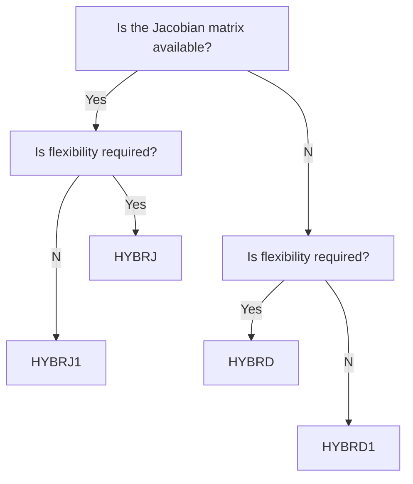
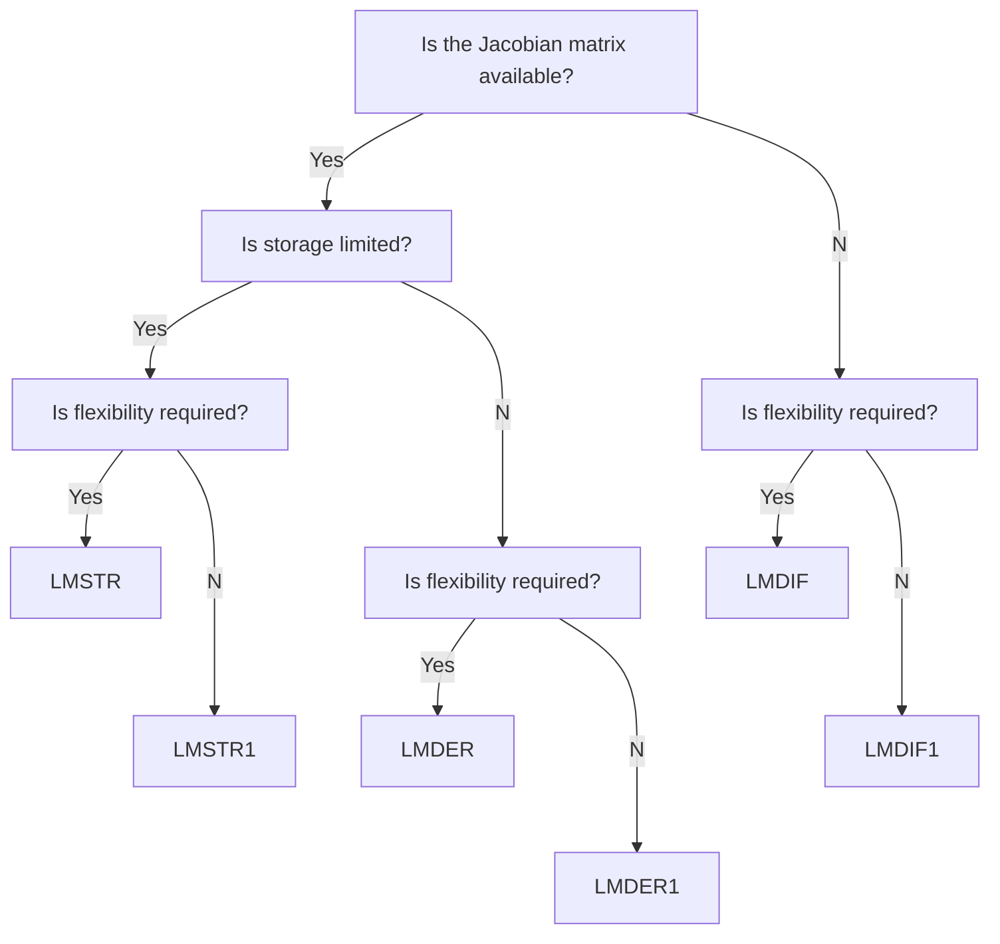

============

Modernized Minpack

### Description

Minpack includes software for solving nonlinear equations and
nonlinear least squares problems.  Five algorithmic paths each include
a core subroutine and an easy-to-use driver.  The algorithms proceed
either from an analytic specification of the Jacobian matrix or
directly from the problem functions.  The paths include facilities for
systems of equations with a banded Jacobian matrix, for least squares
problems with a large amount of data, and for checking the consistency
of the Jacobian matrix with the functions.

This version is a modernization of the original Fortran 77 code. This is a work in progress. Modifications include:
* Conversion from fixed (`.f`) to free-form (`.f90`) source.
* Modified the tests so they can be automatically run in the [CI](https://github.com/fortran-lang/minpack/actions)

Further updates are planned...

### Decision tree

Decision tree for systems of nonlinear equations

Decision tree for nonlinear least squares porblems

### Documentation

 * The API documentation for the latest default branch can be found [here](https://fortran-lang.github.io/minpack/).  This is generated by processing the source files with [FORD](https://github.com/Fortran-FOSS-Programmers/ford).

### License

The Minpack source code and related files and documentation are distributed under a permissive free software [license](https://github.com/fortran-lang/minpack/blob/HEAD/LICENSE.txt) (BSD-style).

### History

Minpack has been developed in 1980 by Jorge J. Moré, Burton S. Garbow, Kenneth
E.  Hillstrom and other contributors as listed on page 8 of the [User Guide for
MINPACK-1](http://cds.cern.ch/record/126569/files/CM-P00068642.pdf).

Since 2012 Ondřej Čertík has maintained a GitHub repository for minpack with
many contributions from Carlos Une and Zuo Zhihua.

In 2021 Jacob Williams started a new minpack repository at GitHub and
translated all files from fixed form to free form and other modernizations.

We have discussed at https://github.com/fortran-lang/minpack/issues/8 which
version to use as the community maintained fortran-lang version and decided to
use the latter repository, which became the fortran-lang version. We have
been porting improvements from the former repository over to the new fortran-lang repository.

### Contributors

Many people have contributed to Minpack over the years:

* Jorge J. Moré, Burton S. Garbow, Kenneth E.  Hillstrom and other contributors
  as listed on page 8 of the [User Guide for MINPACK-1](http://cds.cern.ch/record/126569/files/CM-P00068642.pdf).
* Ondřej Čertík
* Carlos Une
* Zuo Zhihua
* Jacob Williams
* Sebastian Ehlert

### See also

  * [nlesolver-fortran](https://github.com/jacobwilliams/nlesolver-fortran)

### References
  * Original sourcecode from: [Netlib](https://www.netlib.org/minpack/)
  * J. J. Moré, B. S. Garbow, and K. E. Hillstrom, [User Guide for MINPACK-1](http://cds.cern.ch/record/126569/files/CM-P00068642.pdf), Argonne National Laboratory Report ANL-80-74, Argonne, Ill., 1980.
  * J. J. Moré, D. C. Sorensen, K. E. Hillstrom, and B. S. Garbow, The MINPACK Project, in Sources and Development of Mathematical Software, W. J. Cowell, ed., Prentice-Hall, pages 88-111, 1984.
  * M. J. D. Powell, A Hybrid Method for Nonlinear Equations. Numerical Methods for Nonlinear Algebraic Equations, P. Rabinowitz, editor. Gordon and Breach, 1970.
  * Jorge J. More, The Levenberg-Marquardt Algorithm, Implementation and Theory. Numerical Analysis, G. A. Watson, editor. Lecture Notes in Mathematics 630, Springer-Verlag, 1977.
  * [MINPACK-2](https://ftp.mcs.anl.gov/pub/MINPACK-2/)
